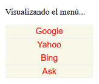
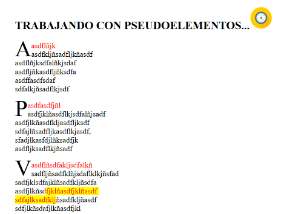
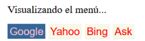
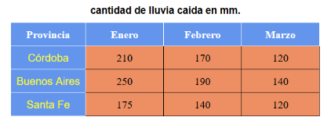
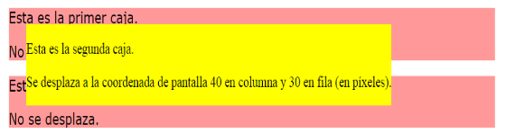
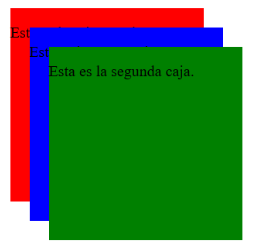
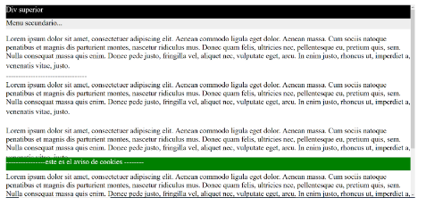
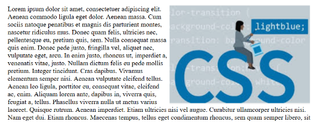
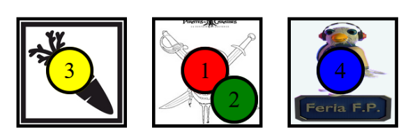

# U.T. 2 .- USO DE ESTILOS

## PRÁCTICA 1.2. REPASO DE ESTILOS CSS (II)

### Objetivo:
Repasar los estilos CSS a través de propuestas sencillas, trabajando: clases, identificadores, cajas, menús, pseudoclases, pseudoelementos, tablas y posiciones.

### Desarrollo:
Se realizarán las tareas enunciadas a continuación, utilizando los materiales aportados por la profesora y consultas de bibliografía e Internet. Elaborando los ficheros necesarios, documentando debidamente con los comentarios oportunos.

---

### 8. A partir del fichero `ut2pr1ej8Menu.html`

Hacer un menú de hipervínculos que muestre los elementos de forma vertical. Se deberán utilizar pseudoclases para cambiar el color de fondo según si el link está:

- Visitado
- No visitado
- El ratón está sobre el link
- El link tiene foco

**Instrucciones:**

- Eliminar el subrayado de los enlaces.
- Los párrafos del menú tendrán un margen y padding de 0px.
- El tipo de letra será Arial.
- Los enlaces tendrán:
  - Un ancho de 160px.
  - Un padding de 3px.
  - Color de fondo: `#f7f8e8`.
  - Texto centrado.
  - Un borde inferior de 1px de grosor con color `#eeeeee`.

**Pseudoclases:**

- Cuando el elemento aún no se ha visitado: color de fuente verde.
- Cuando el elemento se ha visitado: color de fuente rojo.
- Cuando se pasa el ratón por encima: color de fondo `#336699` y color de la fuente rosa.
- Al hacer clic: color de fondo `#336699` y color de la fuente blanco.

Pista: Para conseguir el aspecto deseado, trabaja con la propiedad `display`.

**Referencias:**

- [CSS Link Styles en W3Schools](https://www.w3schools.com/css/css_link.asp)
- [Pseudoclase :visited en MDN](https://developer.mozilla.org/es/docs/Web/CSS/:visited)
- [Pseudoclase :active en MDN](https://developer.mozilla.org/es/docs/Web/CSS/:active)
- [Pseudoclase :link en MDN](https://developer.mozilla.org/es/docs/Web/CSS/:link)
- [Pseudoclase :hover en MDN](https://developer.mozilla.org/es/docs/Web/CSS/:hover)

Ejemplo de visualización:

---

### 9. Mostrar tres hipervínculos y asignar a cada uno un tipo de cursor

Al menos, definir el cursor `help` en uno.

**Referencias:**

- [Propiedad cursor en W3Schools](https://www.w3schools.com/cssref/pr_class_cursor.asp)
- [CSS Link Styles en W3Schools](https://www.w3schools.com/css/css_link.asp)
- [Try It Yourself en W3Schools](https://www.w3schools.com/css/tryit.asp?filename=trycss_cursor)

---

### 10. Mostrar un texto y para cada párrafo:

- Poner la primera letra más grande y alineada a la izquierda.
- La primera línea debe tener color rojo.
- Si seleccionamos texto, se mostrará con un fondo amarillo y color de fuente rojo.
- La página empezará con un encabezado `h2`.
- Al finalizar los encabezados `h2` deberá aparecer un icono.

**Referencia:**

- [Pseudoelementos en W3Schools](https://www.w3schools.com/css/css_pseudo_elements.asp)

Ejemplo de visualización:

---

### 11. Implementar el menú del ejercicio 8 en horizontal

Pista: utiliza `display`.

Ejemplo de visualización:

---

### 12. A partir del fichero `ut2pr1ej12Tabla.html`

Modificar los estilos de la tabla para que se muestren las precipitaciones de 3 provincias durante los meses de enero, febrero y marzo.

Ejemplo de visualización:

---

### 13. A partir del fichero `ut2pr1ej13posici1.html`

Definir 3 elementos de tipo `div`. Luego, mediante la propiedad `position`, desplazar el segundo `div` 15 píxeles a la derecha y 5 hacia abajo.

---

### 14. A partir del fichero `ut2pr1ej14posici2.html`

Mostrar tres cajas de texto mediante `div`. Luego, posicionar la segunda caja en la coordenada `(40, 30)` de la página (40px en columna y 30px en fila) con posición absoluta.

Ejemplo de visualización:

---

### 15. Mostrar tres `div` de color rojo, verde y azul con posiciones absolutas

- Indicar coordenadas para que se superpongan.
- Inicializar la propiedad `z-index` de cada elemento de tal manera que quede al frente el `div` verde, luego el azul, y finalmente el rojo.
- Define el ancho y alto de las cajas a 200px.

Ejemplo de visualización:

---

### 16. Dado el archivo `ut2pr1ej16PosicFixed.html`

Mostrar un `div` superior y otro para cookies con posicionamiento fijo. Juega con los posicionamientos de otros `div`, muévete con el scroll y comprueba el funcionamiento.

**Referencia:**

- [Posicionamiento en CSS en W3Schools](https://www.w3schools.com/css/css_positioning.asp)

Ejemplo de visualización:

---

### 17. A partir del fichero `ut2pr1ej17Float.html` y la imagen `imagen.png`

Mostrar la imagen situada a la derecha. Probar luego a modificar la propiedad `float` con los otros dos valores posibles (`left`, `none`).

Ejemplo de visualización:

---

### RETO 01 - Preparar tablero con fichas

Modifica el fichero `.css` de este .zip para crear una página web con un tablero de 3 casillas y 4 fichas que tenga el siguiente aspecto:

- El ancho y alto de cada casilla será de 100px.
- El ancho y alto de cada ficha será de 40px.

  
